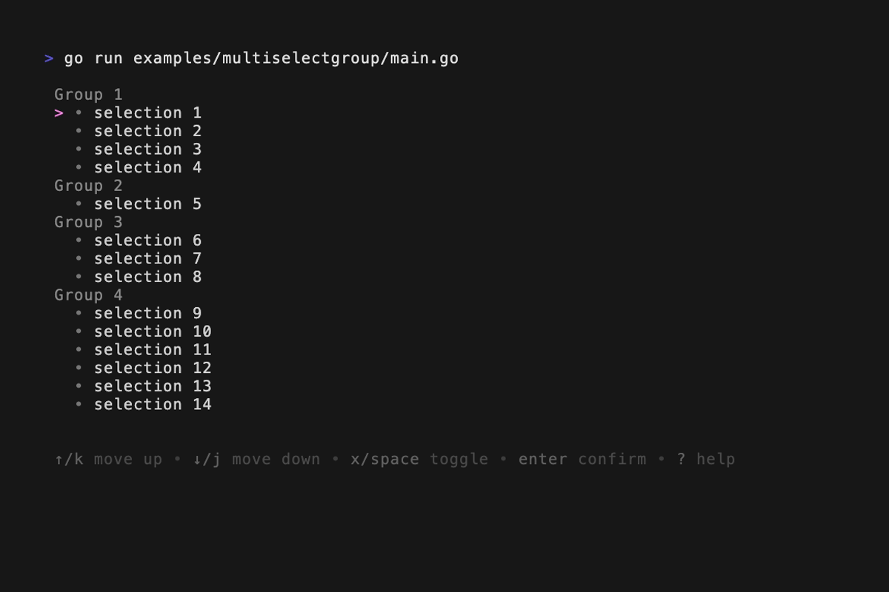

# bubbles
some custom bubbletea components

## Components
### Like [huh's](https://github.com/charmbracelet/huh) Multiselect but with groups that can be seamlessly jump between groups


```go
package main

import (
	"fmt"

	tea "github.com/charmbracelet/bubbletea"
	mg "github.com/ignoxx/bubbles/multiselectgroup"
)

func main() {
	ms := mg.NewMultiSelectGroup(
		mg.Group[string]{
			ID: "Group 1",
			Options: []mg.Option[string]{
				{ID: "s1", Name: "selection 1"},
				{ID: "s2", Name: "selection 2"},
				{ID: "s3", Name: "selection 3"},
				{ID: "s4", Name: "selection 4"},
			},
		},
		mg.Group[string]{
			ID: "Group 2",
			Options: []mg.Option[string]{
				{ID: "s5", Name: "selection 5"},
			},
		},
		mg.Group[string]{
			ID: "Group 3",
			Options: []mg.Option[string]{
				{ID: "s6", Name: "selection 6"},
				{ID: "s7", Name: "selection 7"},
				{ID: "s8", Name: "selection 8"},
			},
		},
		mg.Group[string]{
			ID: "Group 4",
			Options: []mg.Option[string]{
				{ID: "s9", Name: "selection 9"},
				{ID: "s10", Name: "selection 10"},
				{ID: "s11", Name: "selection 11"},
				{ID: "s12", Name: "selection 12"},
				{ID: "s13", Name: "selection 13"},
				{ID: "s14", Name: "selection 14"},
			},
		},
	)

	// save final result
	var results []mg.Option[string]
	ms.Value(&results)

	if _, err := tea.NewProgram(ms).Run(); err != nil {
		panic(err)
	}

	fmt.Println("Result:")
	for _, option := range results {
		fmt.Printf("%s: %t\n", option.ID, option.Selected)
	}
}
```

